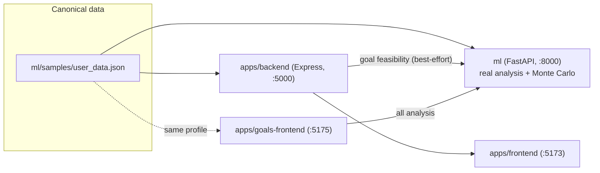

# WealthAI — Personal Finance Dashboard + Goal Achievement Intelligence Engine

A personal-finance monorepo made of three apps that share one canonical dataset:

- **`apps/frontend`** — the main WealthAI dashboard (net worth, portfolio, transactions, tax, insurance, AI advisor).
- **`apps/goals-frontend`** — a focused Goals app with live Monte-Carlo-backed feasibility, what-if simulation and recommendations.
- **`apps/backend`** — an Express BFF serving demo data for the main dashboard.
- **`ml`** — the Goal Achievement Intelligence Engine: a FastAPI service with the real financial analysis (expense intelligence, forecasting, goal feasibility, Monte Carlo simulation, recommendations).

## Architecture & single source of truth

`ml/samples/user_data.json` is the **one canonical demo dataset** (income, assets,
liabilities, goals). Everything else is derived from it instead of inventing its
own numbers, which is what used to make the two frontends disagree with each other:



- `apps/backend` reads the canonical JSON directly (see `apps/backend/src/data/canonicalUser.ts`)
  for the user's identity, income and goals, and asks the ML engine for each goal's
  real feasibility (`apps/backend/src/services/mlClient.ts`). If the ML engine isn't
  running yet, it falls back to a clearly-labelled local estimate instead of failing.
- `apps/goals-frontend` calls the ML engine directly for every analysis (situation,
  goals, forecasts, simulations, recommendations) — see repo memory / its own code
  for details.
- Dashboard sections the ML engine doesn't model at all (portfolio holdings, tax
  breakdown, insurance policies, market ticker) remain hand-authored demo data in
  `apps/backend`, since there's no second implementation of those to conflict with.

## Repository layout

```
Hackathon/
├── package.json            # npm workspaces + `npm run start:dev`
├── apps/
│   ├── backend/            # Express BFF (port 5000)
│   ├── frontend/           # Main dashboard (Vite + React, port 5173)
│   └── goals-frontend/     # Goals app (Vite + React, port 5175)
├── ml/                     # Goal Achievement Intelligence Engine (FastAPI, port 8000)
│   ├── samples/user_data.json  # ← canonical demo dataset (single source of truth)
│   ├── tests/               # pytest suite
│   └── README.md            # technical deep-dive on the ML engine
└── scripts/
    ├── start-ml.sh          # boots the ML engine (auto-creates ml/venv)
    └── setup-ml.sh           # ensures ml/venv has runtime + test deps
```

## Quick start

Requires Node.js 18+ and Python 3.9+.

```bash
npm install
npm run start:dev
```

This starts all four services together (labelled, colorized output via `concurrently`):

| Service        | URL                            |
|----------------|---------------------------------|
| ML engine      | http://localhost:8000 (docs at `/docs`) |
| Backend        | http://localhost:5000           |
| Frontend       | http://localhost:5173           |
| Goals frontend | http://localhost:5175           |

Each piece can also be run on its own: `npm run dev:ml`, `npm run dev:backend`,
`npm run dev:frontend`, `npm run dev:goals`.

## Testing

```bash
npm test          # backend (Jest+Supertest) + frontend & goals-frontend (Vitest)
npm run test:ml    # ml engine (pytest — unit tests + FastAPI endpoint tests)
npm run test:all   # both of the above
```

## Environment variables

- `apps/backend`: `PORT` (default `5000`), `ML_API_URL` (default `http://localhost:8000`).
- `apps/goals-frontend`: `VITE_ML_API_URL` (default `http://localhost:8000`).
- `ml`: see `ml/config.py` / `ml/README.md`.
